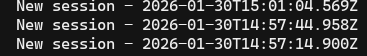
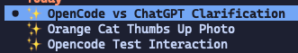

# opencode-autotitle

AI-powered automatic session naming for [OpenCode](https://opencode.ai).

Automatically generates descriptive titles for your OpenCode sessions based on conversation context, replacing generic timestamp-based names like "2024-01-15 14:30" with meaningful descriptions like "Setup React Auth Flow".

## From Timestamp Chaos to Meaningful Titles

| Before | After |
|--------|-------|
|  |  |

## Features

- **Two-phase titling**: Instant keyword title on user message, refined AI title after response
- **AI-powered**: Auto-selects cheapest available model (flash/haiku/fast) for title generation
- **Instant feedback**: Keyword-based title appears immediately, no waiting for AI
- **Zero configuration**: Works out of the box with sensible defaults
- **Non-blocking**: Runs in the background, never slows your workflow
- **Respects custom titles**: Won't overwrite manually set session names

## Installation

### Quick Install (Recommended)

**Option 1: Let your AI agent install it**

Paste this into OpenCode, Claude Code, Cursor, or any AI coding assistant:

```
Install opencode-autotitle by following the instructions here:
https://raw.githubusercontent.com/pawelma/opencode-autotitle/refs/heads/master/docs/install.md
```

**Option 2: One-liner**

```bash
curl -fsSL https://raw.githubusercontent.com/pawelma/opencode-autotitle/refs/heads/master/install.sh | bash
```

### Manual Installation

OpenCode loads plugin **files** directly from `~/.config/opencode/plugins/`.

```bash
# Clone, build, and copy the plugin file
tmp_dir=$(mktemp -d)
git clone --depth 1 https://github.com/pawelma/opencode-autotitle "$tmp_dir"
cd "$tmp_dir" && npm install && npm run build
mkdir -p ~/.config/opencode/plugins
cp dist/index.js ~/.config/opencode/plugins/opencode-autotitle.js
rm -rf "$tmp_dir"
```

## How It Works

The plugin uses a **two-phase approach** for instant feedback with quality refinement:

```
┌─────────────────────────────────────────────────────────────────────────┐
│                         OPENCODE SESSION                                │
└─────────────────────────────────────────────────────────────────────────┘
                                    │
                                    ▼
┌─────────────────────────────────────────────────────────────────────────┐
│  PHASE 1: Quick Title (on message.part.updated)                         │
│  ───────────────────────────────────────────────────────────────────────│
│                                                                         │
│   User types message ──► Extract keywords ──► Set title immediately     │
│                                                                         │
│   "Help me set up JWT auth"  ──►  "🔍 Jwt Auth Express"                 │
│                                                                         │
│   • No API call needed                                                  │
│   • Instant title update                                                │
│   • Uses keyword extraction + stop word filtering                       │
└─────────────────────────────────────────────────────────────────────────┘
                                    │
                                    ▼
┌─────────────────────────────────────────────────────────────────────────┐
│  PHASE 2: AI Title (on session.idle)                                    │
│  ───────────────────────────────────────────────────────────────────────│
│                                                                         │
│   AI responds ──► Find cheap model ──► Generate title ──► Update        │
│                                                                         │
│   Context: user question + AI response                                  │
│                                                                         │
│   "🔍 Jwt Auth Express"  ──►  "✨ Setup JWT Auth Express"               │
│                                                                         │
│   • Uses cheapest available model (flash/haiku/fast)                    │
│   • Creates temp session for title generation                           │
│   • More specific title based on actual conversation                    │
└─────────────────────────────────────────────────────────────────────────┘
                                    │
                                    ▼
┌─────────────────────────────────────────────────────────────────────────┐
│  RESULT                                                                 │
│  ───────────────────────────────────────────────────────────────────────│
│                                                                         │
│   🔍 = Keyword-based title (fast fallback)                              │
│   ✨ = AI-generated title (final quality)                               │
│                                                                         │
│   Custom user titles are never overwritten                              │
└─────────────────────────────────────────────────────────────────────────┘
```

### State Management

```
┌──────────────────────────────────────────────────────────────┐
│                      Plugin State                            │
├──────────────────────────────────────────────────────────────┤
│  keywordTitledSessions: Set<string>   ← Has 🔍 title         │
│  aiTitledSessions: Set<string>        ← Has ✨ title (done)  │
│  pendingAISessions: Set<string>       ← Currently processing │
│  cheapestModel: cached model choice   ← Lazily discovered    │
└──────────────────────────────────────────────────────────────┘
```

### Title Generation

Phase 1 sets a quick keyword title, Phase 2 refines it with AI:

| User Message | Generated Title |
|--------------|-----------------|
| "Help me set up authentication with JWT in my Express app" | "Setup JWT Auth Express" |
| "There's a bug in the login form, it's not validating emails" | "Fix Login Email Validation" |
| "Can you refactor the database queries to use connection pooling?" | "Refactor Database Pooling" |
| "Write tests for the payment processing module" | "Testing Payment Module" |

## Configuration

All configuration is optional. The plugin works out of the box.

### Environment Variables

| Variable | Default | Description |
|----------|---------|-------------|
| `OPENCODE_AUTOTITLE_MODEL` | (auto) | Model ID like `anthropic/claude-haiku-4-5` |
| `OPENCODE_AUTOTITLE_MAX_LENGTH` | `60` | Maximum title character length |
| `OPENCODE_AUTOTITLE_DISABLED` | `false` | Set to `1` to disable the plugin |
| `OPENCODE_AUTOTITLE_DEBUG` | `false` | File path for debug logs (e.g., `debug.log`) |

### Model Selection

By default, the plugin auto-discovers the cheapest available model from your connected providers, preferring models with names like `fast`, `flash`, `haiku`, or `mini`. To use a specific model for title generation:

```bash
export OPENCODE_AUTOTITLE_MODEL="anthropic/claude-haiku-4-5"
```

Recommended models for title generation:
- `anthropic/claude-haiku-4-5` - Fast and cheap
- `openai/gpt-4o-mini` - Good balance
- `google/gemini-2.0-flash` - Very fast

## Troubleshooting

### Plugin not loading

1. Check installation location:
   ```bash
   ls ~/.config/opencode/plugins/opencode-autotitle/dist/
   ```
2. Or verify in config:
   ```bash
   cat ~/.config/opencode/opencode.json | grep autotitle
   ```

### Titles not generating

Enable debug mode to see what's happening:

```bash
export OPENCODE_AUTOTITLE_DEBUG=debug.log
opencode
# In another terminal: tail -f debug.log
```

Look for `[autotitle]` messages in the output.

### AI generation failing

The plugin automatically falls back to keyword extraction. If you want to fix AI generation:

1. Verify your model is configured: `opencode /models`
2. Check the model ID format: `provider/model-name`
3. Ensure API keys are set for your provider

## Development

```bash
# Clone the repository
git clone https://github.com/pawelma/opencode-autotitle
cd opencode-autotitle

# Install dependencies
bun install

# Build
bun run build

# Watch mode
bun run dev

# Type check
bun run typecheck
```

## Inspirations

This project was inspired by and builds upon ideas from:

- **[oh-my-opencode](https://github.com/code-yeongyu/oh-my-opencode)** - The comprehensive OpenCode enhancement suite that pioneered the agent-assisted installation pattern and demonstrated what's possible with OpenCode plugins. The installation documentation approach used here is directly inspired by their excellent developer experience.

- **[opencode-zellij-namer](https://github.com/24601/opencode-zellij-namer)** - AI-powered Zellij session naming plugin that showed how to elegantly combine AI generation with fallback heuristics for naming. The signal collection and intent inference patterns in this plugin were influenced by their implementation.

Thank you to the maintainers and contributors of these projects for sharing their work with the community.

## License

MIT - see [LICENSE](LICENSE)

## Contributing

Contributions are welcome! Please feel free to submit a Pull Request.

1. Fork the repository
2. Create your feature branch (`git checkout -b feature/amazing-feature`)
3. Commit your changes (`git commit -m 'Add amazing feature'`)
4. Push to the branch (`git push origin feature/amazing-feature`)
5. Open a Pull Request

> **Note:** Currently tested with the GitHub Copilot provider only.
